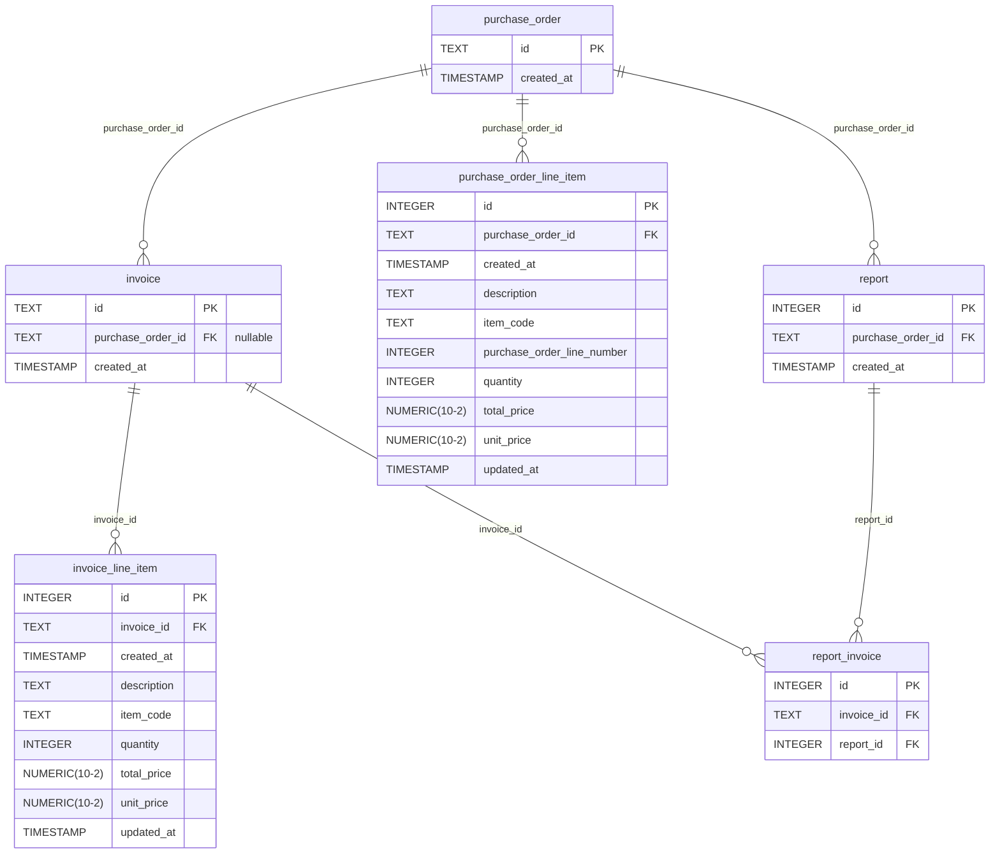

# File AI Coding Challenge

- [Prompt: PO - Invoice Matching Assessment use case](./additional_documents/Prompt_PO%20-%20Invoice%20Matching%20Assessment%20use%20case.pdf)

- [Job Description: Senior Solution Engineer](./additional_documents/JD_Sr.Solution%20Engineer.pdf)

  - The JD specifically asks for "Hands-on experience with Python and SQL." so
    the application is built in Python and PostgreSQL.


## Quickstart

1. [Install uv](https://docs.astral.sh/uv/getting-started/installation/)
2. `uv sync` to update dependencies.
3. `uv run pre-commit install` to install pre-commit hooks.
4. `docker-compose --profile dev up` to initialize database and run the code.
  - `docker-compose --profile test up` to start the testing database.
5. `uv run app/src/main.py` 


## Testing

- Bring up the test db `docker-compose --profile test up -d`
  - The test database is guaranteed to be identical to the `dev` database.
  
- From [./app](./app) execute `uv run pytest`

- The test db uses transactions to automatically reset after each test.
  If you need to wipe the db for some reason, simply run the following.
  
  - `docker-compose --profile test down -v`
  - `docker-compose --profile test up -d`


## Functional Requirements Checklist

- [x] System must read two Excel files.
  - [x] PO.xlsx
  - [x] Invoices.xlsx
- [x] Validate column headers -- [app/src/validators](app/src/validators/)
- [x] Normalize data types (numbers, text) -- pandas does this automatically


## Data

### Entity-Relationship Diagram

This diagram is auto-generated on commit by [update_readme.py](./scripts/entity-relationship-diagrams/update_readme.py)
using [paracelsus](https://github.com/tedivm/paracelsus).

DO NOT EDIT IT MANUALLY





### Models

⚠️ We do not normalize items into their own table.
The price of an item could change over time, and thus across purchase orders,
so we want to track them in-line.

We *do* want to ensure that item prices are consistent throughout a purchase
order and all invoices and in order to do so we require the following...

- [x] An item may only be listed *once* on a given purchase order.

- [x] An item may only be listed *once* on a given invoice: there is no
  problem with an item appearing multiple times across several invoices. 

- [ ] The purchase order sets the unit price of an item, any discrepancies found
  thereafter in an invoice will be treated as an error.


### Data Flow

```mermaid
flowchart LR
    Validate File Name -> Identification --> Validation --> Ingestion --> Report
```

When a new invoice or purchase order is ingested, the id of the purchase order
goes into a queue. The `Report` phase reads purchase orders from the queue and
generates a report for each one.

Purchase orders are unique within the queue, so at most one report will be
generated per purchase order, even if multiple invoices come in before the `Report`
phase runs.


The report phases sets the transaction isolation level to Serializable to ensure
no incoming data can interfere while a report is being generated.
[Postgres Docs: transactions](https://www.postgresql.org/docs/current/transaction-iso.html)


#### Validate File Name

File names must start with either `Invoice` or `PurchaseOrder`. This is because
if files are batch-loaded we ensure that purchase orders are ingested before invoices.

If an invoice references a purchase order that has not been ingested, it is considered invalid.
We certainly don't want to allow the system to ingest invoices for purchase orders that
do not exist!


#### Identification

Relies solely on the columns in the excel sheet.


#### Validation

* Each ingestion operation is wrapped in a transaction to ensure atomicity.

1. Validate and Import purchase order.
  TODO: Go through this checklist in detail
  - [ ] Ensure `PO Number` is consistent across all rows for a give PO.
  - [ ] Create `purchase_orders` record.
  - [ ] Create `purchase_order_lines` record for each line.
    - [ ] Ensure that `Quantity * Unit Price == Total Amount`

2. Validate invoice again purchase order.
  - [ ] Ensure `PO Number` is consistent across all rows for a given invoice.
  - [ ] Ensure `PO Number` matches an existing purchase order
  - [ ] Ensure `Invoice Number` is consistent across all rows for a given invoice.
  - [ ] Create `invoices` record.
  - [ ] Create `invoice_lines` record for each line.
    - [ ] Ensure that `Unit Price` on the invoice line matches the purchase order.
    - [ ] Ensure that `Quantity * Unit Price == Total Amount`


### Ingestion

Files are read from [app/files/input](./app/files/input/). Once the records for
a file are stored in the database, the file is moved to
[app/files/output/ingested](./app/files/output/ingested/).

If an error occurs during this copying of the file, the transaction handling ingestion
will fail. This ensures that a file will only be ingested if the input file is copied
successfully.


#### Analysis

If we were processing massive amounts of data here, it would make more sense
to do this in SQL and then send the result back to Python, but I think it's
safe to assume that a single purchase order and its invoices will never
contain enough data for this to be a concern.

As a demonstration of ability to do so, we use both database queries and Python
programming to aggregate data for reports.


#### Report

The reports can be found in [app/files/output/reports](./app/files/output/reports/).
Report file-names contain the id of the purchase order, and a time-stamp for when
the report was generated.


## Tech Stack and Library Choices

Documenting my thought process as I go.

- Quality of Life: choices that automate tasks during development.
  - [pre-commit](https://pre-commit.com/) to manage git hooks.
  - [Black](https://github.com/psf/black) to format code.


- [Docker](https://www.docker.com/): Easily run the application yourselves.


- Python dependency management: [uv](https://docs.astral.sh/uv/)

    - [Poetry](https://python-poetry.org/) is another option.
      I personally find uv more intuitive and it's also
      [much faster than poetry](https://github.com/astral-sh/uv/blob/main/BENCHMARKS.md).

    - Why not just `requirements.txt`? 
      `requirements.txt` does not enforce version requirements on dependencies 
      of packages. `uv` explicitly raise errors at install time. Furthermore,
      `uv` also manages your python version and automatically creates a
      [venv](https://docs.python.org/3/library/venv.html).


- Use [typing](https://docs.python.org/3/library/typing.html)

  - Typing has been part of the standard library since 3.5, which was released in 2015.
    The real world was slow to catch up, but it's not uncommon to see them these days.
    I try to make a habit of using them whenever I can.


- Data Ingestion/Output (Read/Write Excel): [pandas](https://pandas.pydata.org/)

    - pandas depends [openpyxl](https://openpyxl.readthedocs.io/en/stable/),
      while it's possible to use openpyxl directly, pandas offers a more powerful api
      and is popular enough that many engineers and data scientists already have
      experience with it.

    - pandas also comes with capabilities for data validation and normalization.
      It even auto-detects types in excel!


- Database Migrations

  - A popular choice in Python is [Alembic](https://alembic.sqlalchemy.org/en/latest/)
    which is built on [SQLAlchemy](https://www.sqlalchemy.org/).
    However, the use of Alembic doesn't necessarily demonstrate knowledge of SQL.
    For this reason I've opted to write the initialization scripts in pure SQL and use
    [/docker-entrypoint-initdb.d](https://docs.docker.com/guides/pre-seeding/#pre-seed-the-database-by-bind-mounting-a-sql-script)
    to ensure the database initialization is run on container startup.


- Database Queries: Using an ORM

  - [SQLAlchemy](https://www.sqlalchemy.org/). This is by far the most mature
    and widely used ORM in Python. I think it's actually the first ORM I ever used.

  - I looked into [Tortoise ORM](https://github.com/tortoise/tortoise-orm?tab=readme-ov-file#introduction)
    and their benchmarks actually show [Pony ORM](https://github.com/ponyorm/pony) as being the fastest.

    However, Tortoise is too early-stage as it does not promise a stable API,
    and Pony is nowhere near production-ready as it lacks basic features and
    documentation.


- Database Entity Relationship Diagrams

  - Use [paracelsus](https://github.com/tedivm/paracelsus) to auto-generate the
    entity-relationship diagram found in this README.

  - [Version 0.14.0 of paracelsus](https://github.com/tedivm/paracelsus/releases/tag/v0.14.0)
    was released in response to [a bug report I created while working on this project](https://github.com/tedivm/paracelsus/issues/51)


- Testing

  - Use [pytest](https://docs.pytest.org/en/stable/index.html) because of it's
    built-int support for [fixtures](https://docs.pytest.org/en/stable/explanation/fixtures.html)


## Going Further

In a production system I would implement the following additional features.

- Add file-hashes

  - Excel stores metadata which can change if a file is saved, even if the contents remain the same.
    Thus, we need to hash the data itself, and not the file.

    1. Deterministically order the columns of your data.
    2. Write each sheet of the report out to a csv.
    3. Concatenate the CSVs, and hash the result.
  
  - This gives you the ability to verify that the data in a file matches the data in a file
    issued by your system.

- Add filename of report to db report record.

- Add soft-delete.
  
  - For systems designed to be audited, it's often better to soft-delete records.
  
  - To keep queries efficient with soft-deletes I would use [partial indexes](https://www.postgresql.org/docs/current/indexes-partial.html)
